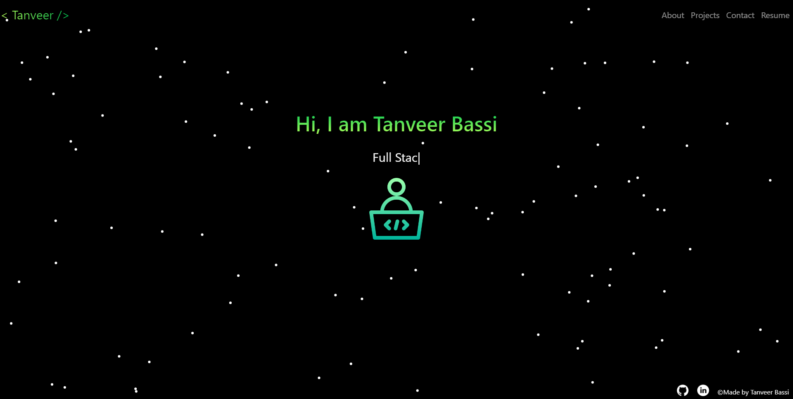
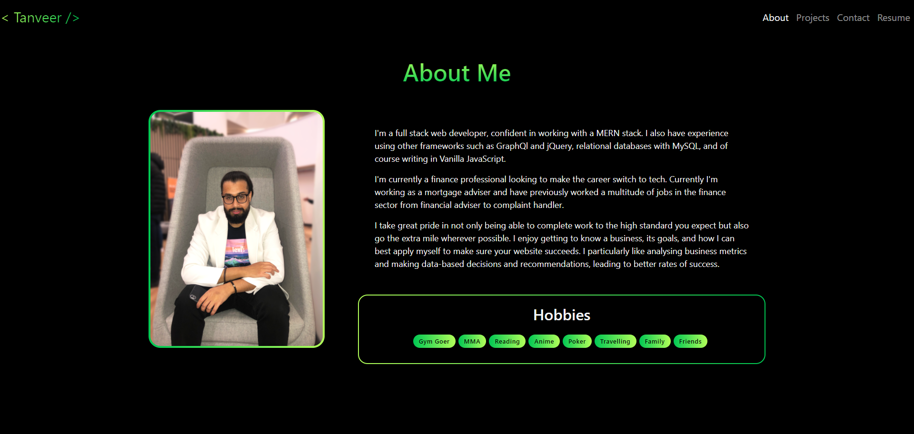
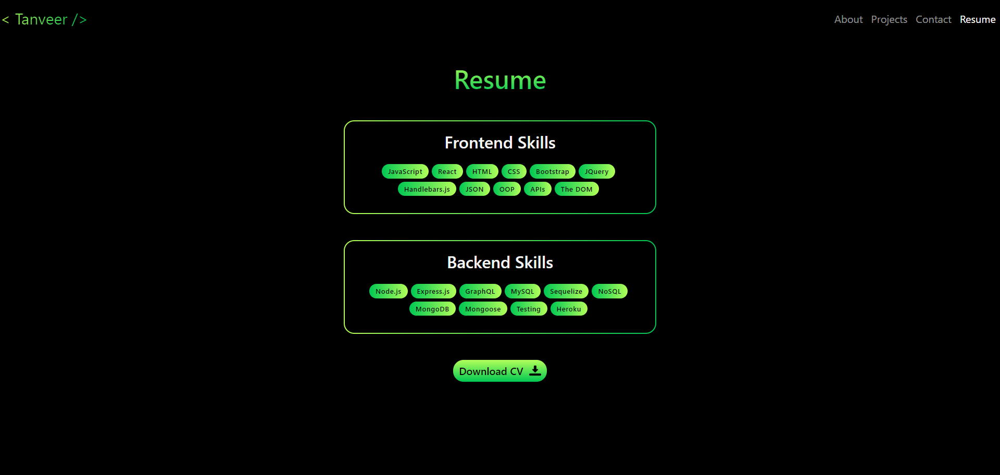
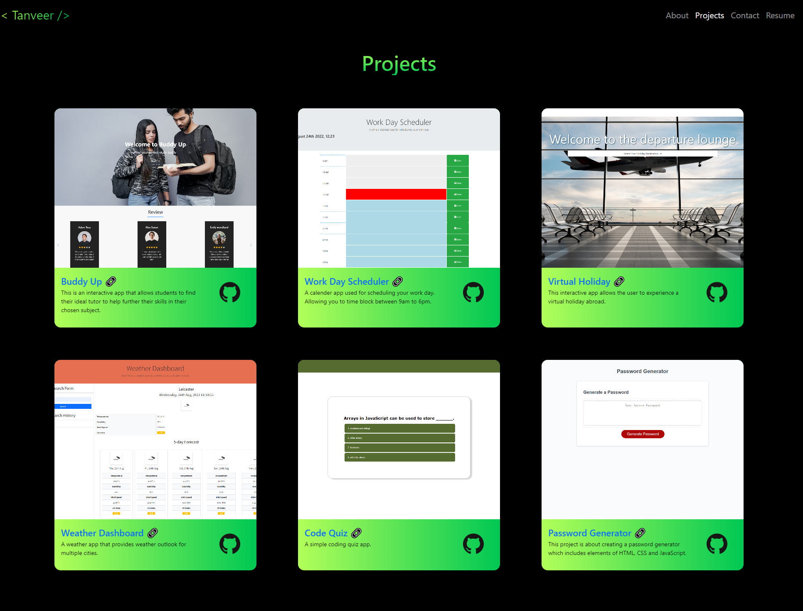
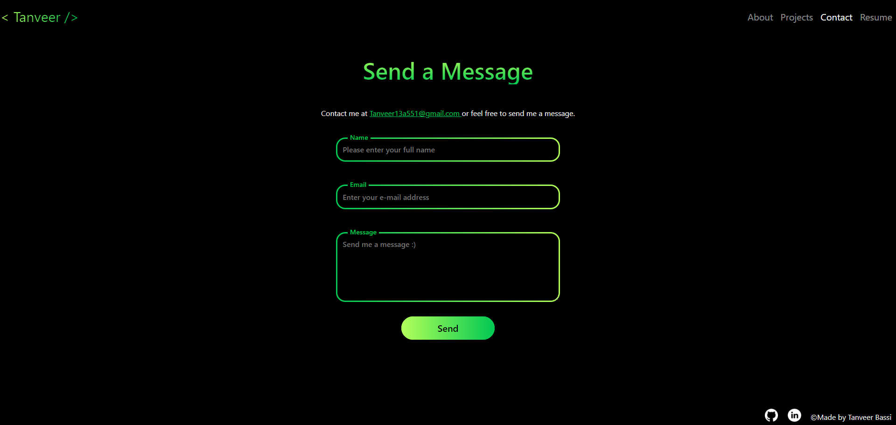

# Tanveer Bassi - React Portfolio

# Description 📕

My react portfolio built to showcase my recent works and the different technologies used to build these apps.

# View the project 👀

[React Portfolio 🚀](https://TanveerBassi.github.io/react-portfolio)

# Technologies 🔍

```
React
React Bootstrap
React-router-dom
CSS
HTML
JavaScript
```

# Getting Started 🚀

```
git clone git@github.com:TanveerBassi/react-portfolio.git
npm i
npm run start
```

# Screenshots 📸







# Contact ✋

```
GitHub - https://github.com/TanveerBassi
E-mail - Tanveer13a551@gmail.com
LinkedIn - https://www.linkedin.com/in/tanveer-bassi-0abb80104/
```
